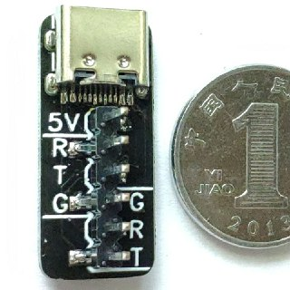
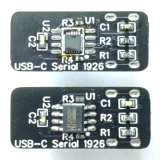

# USB-C Serial
An USB-C to UART adapter powered by FT234XD or CH330N.

## Schematic

[Link](docs/Schematic_USB-C-Serial_Sheet-1_20190707141051.pdf)

## BOM

Designator	|	Name	|	Footprint	|	Quantity	|	Options
----------  | ----  | --------- | --------  | --------
USBC1	|	TYPE-C-31-M-12	|	USB-TYPE-C_16PIN-MALE-TYPE-C-31-M-12	|	1	|	
R1,R2	|	5.1K	|	0603'	|	2	|	
C1,C2	|	100nF	|	0603'	|	2	|	
H1	|	95293-401A06LF	|	95293-401A06LF	|	1	|	
R3,R4	|	27Ω	|	0402'	|	2	|	FTDI-Based Only
U1	|	FT234XD-T	|	DFN-12_13PIN-L3.00-W3.00-PITCH0.45-EP-BR	|	1	|	FTDI-Based Only
U2	|	CH330N	|	SOP-8_150MIL	|	1	|	WCH-Based Only

